<p align="center">
  <picture>
    
  </picture>
</p>

<p align="center">
  <strong>One config, every platform — sign Windows · macOS · Linux · Android · iOS from a single CLI. Keys never live here.</strong>
</p>

<p align="center">
  <a href="#what-it-does">What it does</a> ·
  <a href="#public-safety-keys-never-live-here">Public safety</a> ·
  <a href="#install">Install</a> ·
  <a href="#usage">Usage</a> ·
  <a href="#architecture">Architecture</a> ·
  <a href="#license">License</a>
</p>

<p align="center">
  
  
  
  
</p>

---

## What it does

**SealWard** is a cross-platform code-signing orchestrator. One CLI and one
declarative config sign software artifacts for **Windows, macOS, Linux, Android,
and iOS** by delegating to each platform's canonical signing tool over a
pluggable key-custody abstraction:

| Platform | Backend tools |
|---|---|
| Windows | SignTool / osslsigncode / jsign + RFC-3161 timestamp |
| macOS | codesign + notarytool + stapler |
| Linux | GPG + minisign + Sigstore cosign |
| Android | apksigner (v2/v3/v4) + jarsigner |
| iOS | codesign + Fastlane Match (BYO private profile repo) |

It verifies every signature after producing it (`verify-after-sign`), emits a
structured `SigningOutcome` JSON for each operation, and signs its **own
releases** with Sigstore keyless provenance plus a CycloneDX SBOM and SLSA
attestation. SealWard is engine-, CLI-, and model-agnostic.

## Public safety — keys never live here

This repository's source is **public on purpose**. A signing tool's security
comes from **private-key secrecy and HSM/KMS custody**, not from hiding the
source — this is [Kerckhoffs's principle](https://en.wikipedia.org/wiki/Kerckhoffs's_principle).
The entire industry signs production software with public tools (cosign, jsign,
osslsigncode, minisign, apksigner, codesign, SignTool).

SealWard **never reads, stores, or commits key material.** It resolves a key
**handle** — a PKCS#11 slot label, a Windows CNG key name, an Azure Key Vault
URI, an AWS KMS ARN, a Google Cloud KMS resource, or a HashiCorp Vault path —
and lets the external custody store perform the cryptographic operation. Under
the [CA/Browser Forum hardware-key mandate](https://www.entrust.com/blog/2022/09/ca-browser-forum-updates-requirements-for-code-signing-certificate-private-keys)
(effective 2023-06-01), code-signing private keys must live in a FIPS 140-2
Level 2 / Common Criteria EAL 4+ hardware module — which is exactly where
SealWard expects them to stay.

Four layers enforce the no-key-material invariant: a hardened
[`.gitignore`](.gitignore), a [`.gitleaks.toml`](.gitleaks.toml) ruleset
(pre-commit + pre-push + CI), and a pre-publish secret-scrub gate. The full
never-commit list and the IP-safety boundary are documented in
[`ships-publicly-vs-never.md`](ships-publicly-vs-never.md).

## Install

```bash
# Core install — zero heavy dependencies; the default path shells out to OS/OSS tools.
pip install sealward

# With Sigstore keyless own-release provenance support:
pip install "sealward[sigstore]"

# With optional cloud key-custody backends (BYO-key, default-OFF):
pip install "sealward[kms]"
```

The default local path needs no cloud account: it uses SignTool / osslsigncode /
GPG / minisign with the keys your platform already custodies. Cloud KMS and
Azure Artifact Signing backends activate only when you configure a handle.

## Usage

```bash
# Sign every target declared in a config file, then verify each signature.
sealward sign --config signing.toml

# Inspect what a config resolves to without signing.
sealward plan --config signing.toml

# Verify an already-signed artifact.
sealward verify --artifact dist/app.exe
```

A signing config references secrets **by handle only** — never by value:

```toml
contract_version = "1"

[[target]]
platform = "windows"
artifact = "dist/*.exe"
key_handle = "pkcs11:slot=0;object=codesign"   # a HANDLE, not a key
timestamp_authority = ["http://timestamp.digicert.com"]
profile = "prod"
```

## Architecture

A single orchestrator dispatches to per-platform backends behind one
`SignBackend` protocol, over a key-custody resolver that returns capabilities
from **handles** (never key bytes). The signer's own releases carry Sigstore
keyless + SBOM + SLSA provenance. The full design rationale — orchestrator,
per-platform backend boundary, pluggable key-custody, and own-provenance — is
recorded in [ADR-0001](docs/adr/0001-cross-platform-code-signer-architecture.md).

```
  signing.toml ──► orchestrator ──► key-custody resolver (handle ⇒ capability)
                        │                         │  pkcs11 · cng · kms · vault
                        ▼                         ▼  (custody stays external)
              ┌─────────┴──────────────────────────────────┐
              ▼          ▼          ▼          ▼          ▼
           windows     macos      linux     android      ios       backends
        (signtool/   (codesign/  (gpg/      (apksigner/  (codesign/
         osslsign/    notarytool/ minisign/  jarsigner)   fastlane-
         jsign)       stapler)    cosign)                 match)
              └──────────────────── verify-after-sign ─────┘
                                    │
                        own releases ▼  sigstore keyless · SBOM · SLSA
```

CI/CD lives in [`.github/workflows/ci.yml`](.github/workflows/ci.yml)
(ruff + pytest/coverage matrix + gitleaks + the pre-publish scrub gate +
pip-audit) and [`.github/workflows/release.yml`](.github/workflows/release.yml)
(scrub-gated build → keyless Sigstore + SBOM + SLSA → human-approved GitHub
release).

## Branding assets

Brand assets are generated by `branding/gen-assets.sh` from committed SVG
sources. The README header and footer reference `.github/assets/header.svg` and
`.github/assets/footer.svg`; the social card is `.github/assets/social-preview.svg`
(1280×640). The motif is the Itasha.Corp "Retro-Future Anime OS" CRT bezel with
phosphor scanlines, with a code-signing-specific central icon — a hexagonal
cryptographic **seal** stamped over warding rings. Only SVG sources are tracked;
rasterized outputs (`*.png`/`*.ico`/`*.icns`) are git-ignored and regenerated on
demand (the generator skips honestly and prints the install command when a
rasterizer is absent — it never writes a stub or corrupt asset).

## License

Dual-licensed under either of:

- MIT license ([LICENSE-MIT](LICENSE-MIT))
- Apache License, Version 2.0 ([LICENSE-APACHE](LICENSE-APACHE))

at your option. © 2026 Itasha.Corp.

<p align="center">
  
</p>
